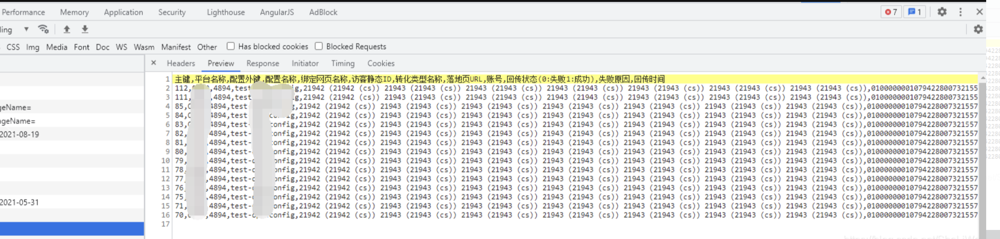

如果是文件流（二进制）excel文件转化为blob，需要传 { responseType: arraybuffer }

```js
configApi.post(`/platform/push/exportCsv`, _params, { responseType: "arraybuffer" }).then(({ data, headers }) => {
console.log(data, headers)

let blob = new Blob([data], { type: 'text/csv;charset=utf-8' }) // 将服务端返回的文件流（二进制）excel文件转化为blob
let fileName = window.decodeURI(headers['content-disposition'].split('=')[1], "UTF-8");

console.log(blob, 'blob')
if (window.navigator && window.navigator.msSaveOrOpenBlob) { // IE
    window.navigator.msSaveOrOpenBlob(blob, fileName)
} else {
    let objectUrl = (window.URL || window.webkitURL).createObjectURL(blob)
    let downFile = document.createElement('a')
    downFile.style.display = 'none'
    downFile.href = objectUrl
    downFile.download = fileName // 下载后文件名
    document.body.appendChild(downFile)
    downFile.click()
    document.body.removeChild(downFile) // 下载完成移除元素
    // window.location.href = objectUrl
    window.URL.revokeObjectURL(objectUrl)   // 只要映射存在，Blob就不能进行垃圾回收，因此一旦不再需要引用，就必须小心撤销URL，释放掉blob对象。
}
})
```

如果是csv，无需 { responseType: “arraybuffer” } ，并且在data 上加 “\ufeff” ，"\ufeff"是为了解决CSV中文乱码问题
接口的返回结果是



处理代码

```js
configApi.post(`/platform/push/exportCsv`, _params).then(({ data, headers }) => {
console.log(data, headers)

let blob = new Blob(["\ufeff" + data], { type: 'application/vnd.ms-excel;charset=utf-8' }) // 将服务端返回的文件流（二进制）excel文件转化为blob
let fileName = window.decodeURI(headers['content-disposition'].split('=')[1], "UTF-8");

console.log(blob, 'blob')
if (window.navigator && window.navigator.msSaveOrOpenBlob) { // IE
    window.navigator.msSaveOrOpenBlob(blob, fileName)
} else {
    let objectUrl = (window.URL || window.webkitURL).createObjectURL(blob)
    let downFile = document.createElement('a')
    downFile.style.display = 'none'
    downFile.href = objectUrl
    downFile.download = fileName // 下载后文件名
    document.body.appendChild(downFile)
    downFile.click()
    document.body.removeChild(downFile) // 下载完成移除元素
    // window.location.href = objectUrl
    window.URL.revokeObjectURL(objectUrl)   // 只要映射存在，Blob就不能进行垃圾回收，因此一旦不再需要引用，就必须小心撤销URL，释放掉blob对象。
}
})
```