## 现象

### ant-design

随便起一个react项目  安装下 ant-design

在 node_modules 中找到 antd 打开后发现如图结构

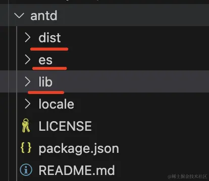

分别看下这三个目录的组件代码：

lib 下的组件是 commonjs 的：

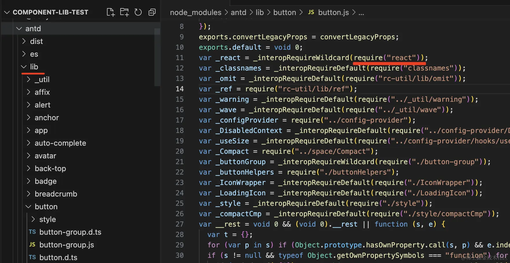

es 下的组件是 es module 的：

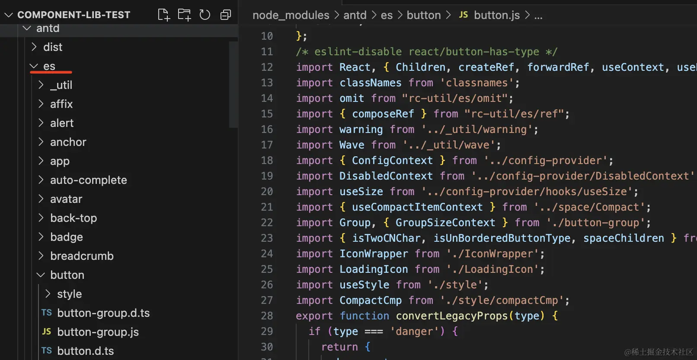

dist 下的组件是 umd 的：

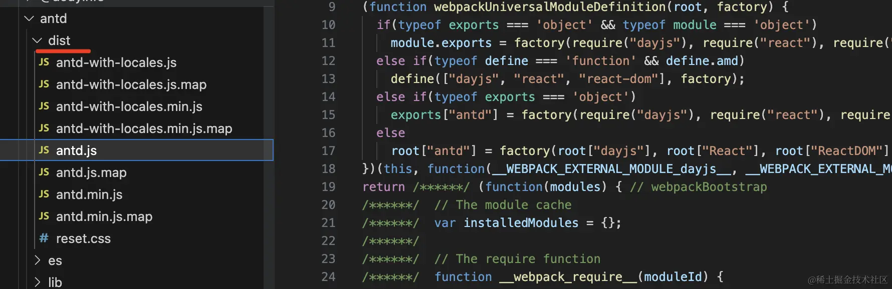

然后在 package.json 里分别声明了 commonjs、esm、umd 还有类型的入口：

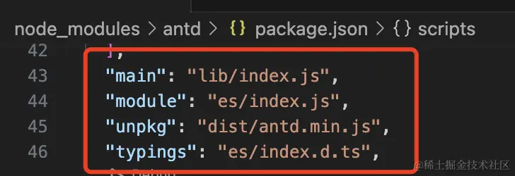

这样，当你用 require 引入的就是 lib 下的组件，用 import 引入的就是 es 下的组件。

而直接 script 标签引入的就是 unpkg 下的组件。

### semi-design

在安装一个 UI 库 semi-design

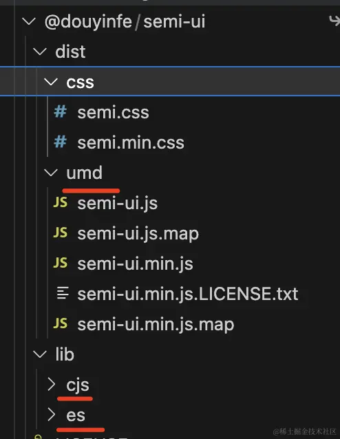
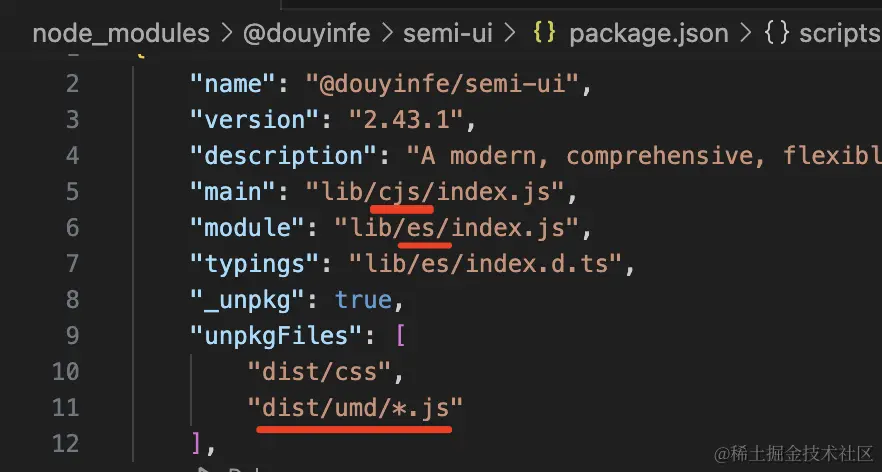

也是一样的，只不过多了个 css 目录，antd 没有这个目录是因为它已经换成 css in js 的方案了，不需要单独引入 css 文件。

### 结论

也就是说，组件库都是这样的，分别打包出 3 份代码（esm、commonjs、umd），然后在 package.json 里声明不同模块规范的入口。

## 原理

但是写代码肯定不会写多份，假如我们有一个UI库，怎么能够打包类似的产物呢？

<b style='color:red'>
  umd 的代码用 webpack 打包就行
</b>
<br/>
<b style='color:red'>
  esm 和 commonjs 的不用打包，只需要用 tsc 或者 babel 编译下就好了
</b>

上面所说的组件库也是这个原理做的，

以 semi-design 为例
打包文件在这个目录下
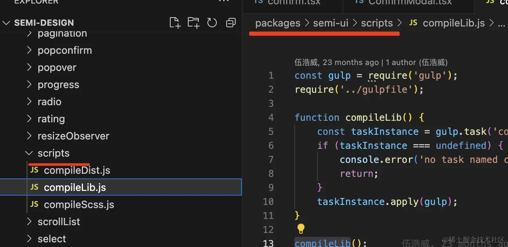

是用到了 gulp 来组织任务。

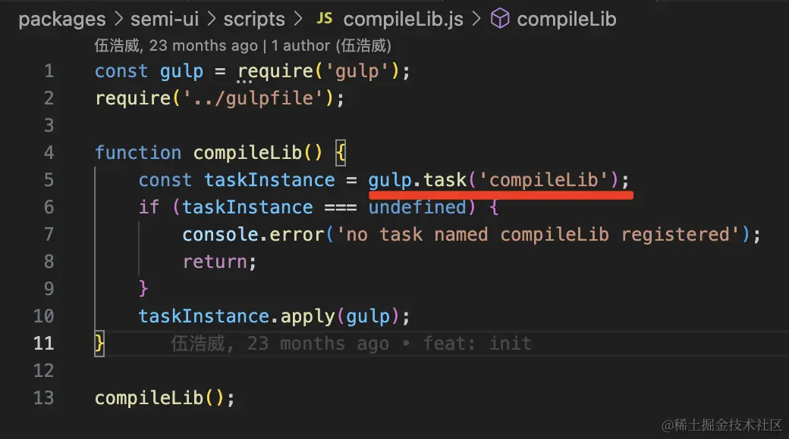

看下这个 compileLib 的 gulp task：

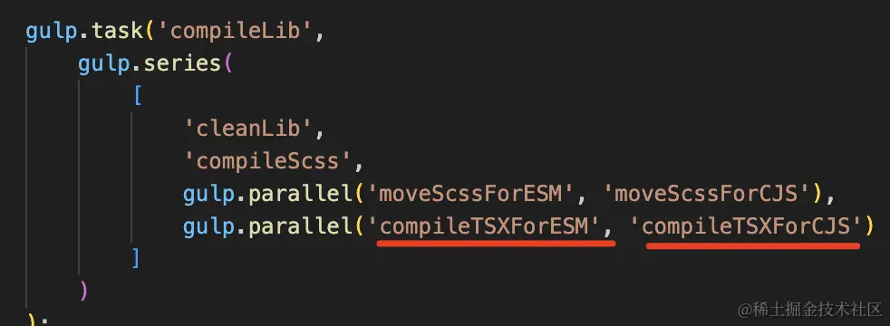

这里的 compileTSXForESM 和 ForCJS 很明显就是编译组件到 esm 和 cjs 两种代码的。

先用了 tsc 编译再用了 babel 编译：

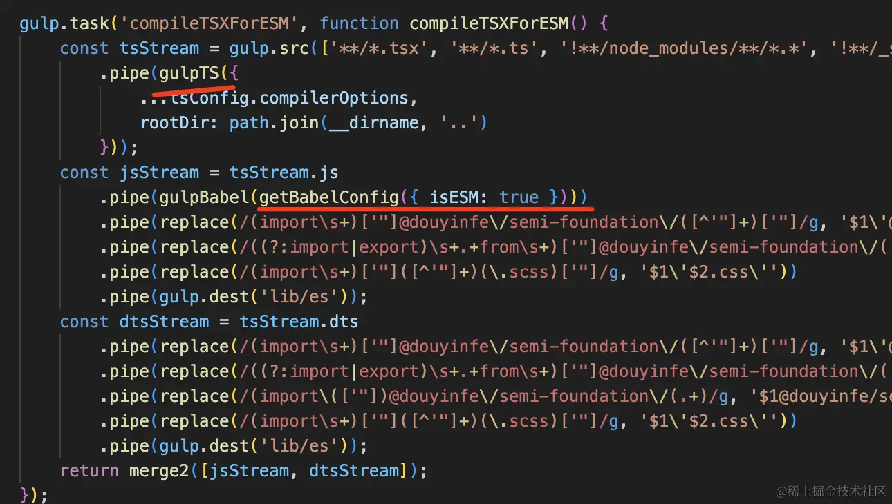

然后是 umd，也是用了 webpack：

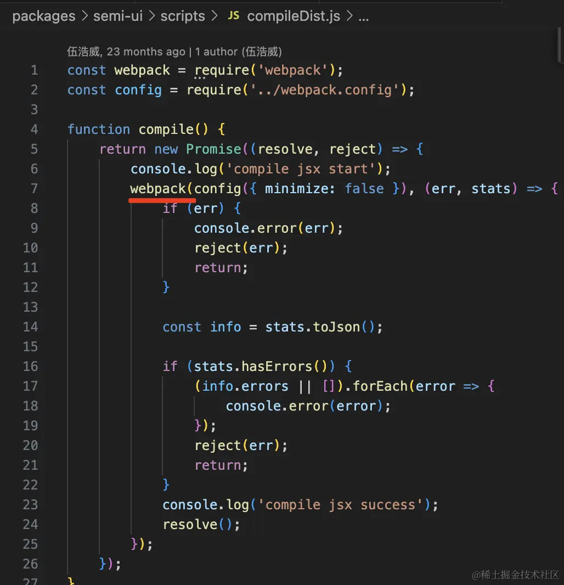

用了 babel-loader 和 ts-loader：

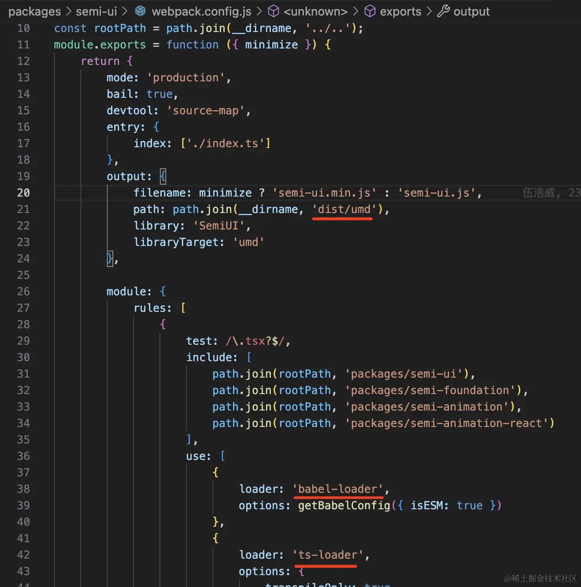

## 总结

所以说 假如我们有一个esm的项目 完全可以按照这个思路 去打包 生成三种规范代码

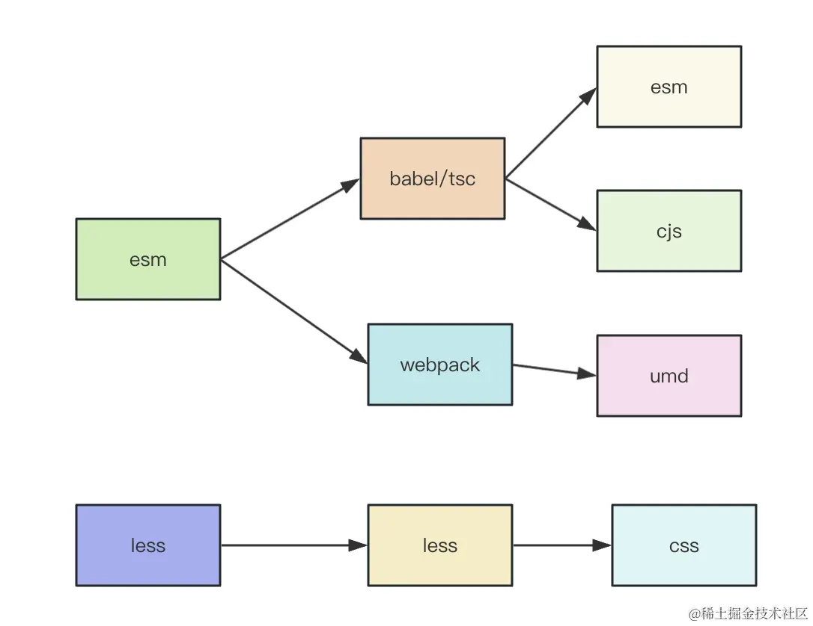

## 测试

随便copy几个写的react组件，按照如下图模式导出

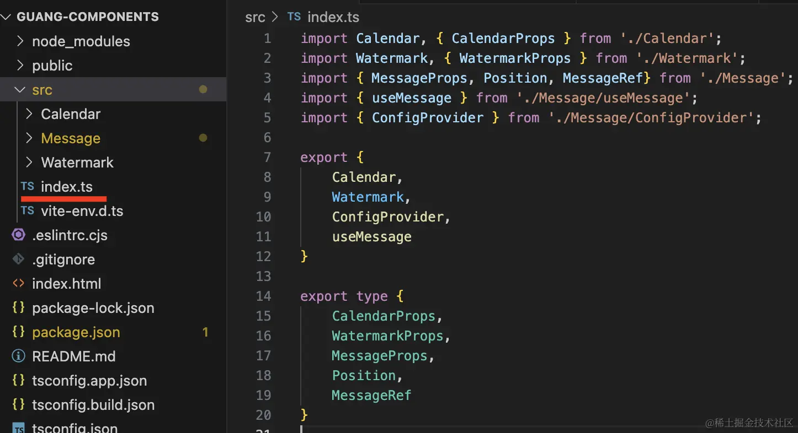

添加一个 tsconfig.build.json 的配置文件：

```json
{
    "compilerOptions": {
      "declaration": true,
      "allowSyntheticDefaultImports": true,
      "target": "es2015",
      "lib": ["ES2020", "DOM", "DOM.Iterable"],
      "module": "ESNext",
      "skipLibCheck": true,
      "moduleResolution": "Node",
      "resolveJsonModule": true,
      "isolatedModules": true,
      //  注意这里 如果不导入react组件的话打包出来的unpkg 会报错，可以 改成 "jsx": "react"
      "jsx": "react-jsx",  
      "allowImportingTsExtensions":null,
      "strict": true,
    },
    "include": [
      "src"
    ],
    "exclude": [
      "src/**/*.test.tsx",
      "src/**/*.stories.tsx"
    ]
}
```

执行如下命令

```js
npx tsc -p tsconfig.build.json --module ESNext --outDir dist/esm

npx tsc -p tsconfig.build.json --module commonjs --outDir dist/cjs
```

看下 dist 的产物,就已经把esm和cjs两种的规范代码编译好了

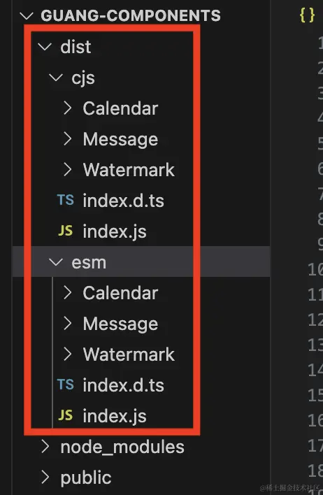

然后再编译下样式：

```js
npx sass ./src/Calendar/index.scss ./dist/esm/Calendar/index.css

npx sass ./src/Calendar/index.scss ./dist/cjs/Calendar/index.css

npx sass ./src/Message/index.scss ./dist/esm/Message/index.css

npx sass ./src/Message/index.scss ./dist/cjs/Message/index.css
```

看下样式也已经加进去了

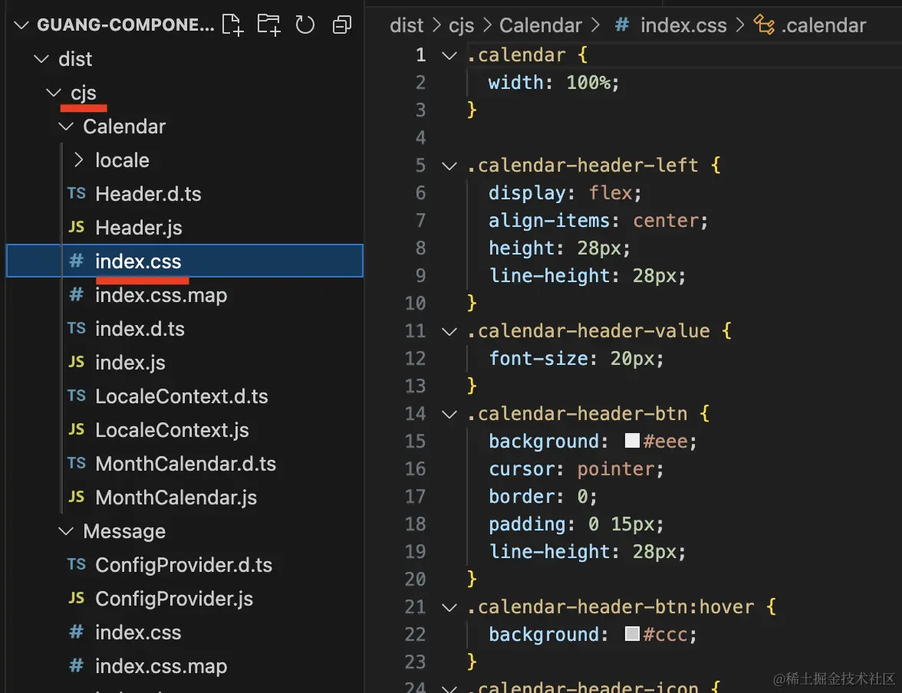
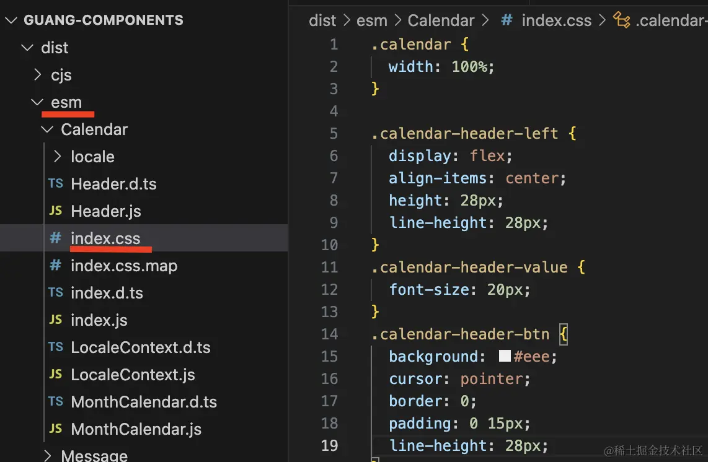

增加 package.json 的入口就可以发布到npm 下载使用了

main 和 module 分别是 commonjs 和 es module 的入口。

types 是 dts 的路径。

files 是哪些文件发布到 npm 仓库，没列出来的会被过滤掉。

```json
"main": "dist/cjs/index.js",
"module": "dist/esm/index.js",
"types": "dist/esm/index.d.ts",
"files": [
    "dist",
    "package.json",
    "README.md"
],
```

<b> 正常的一个项目esm和cjs规范就够了，这也是大多数小项目常用的规范 </b>

至于 umd 现代框架已经很少用到了，当然我们也可以写个小demo打包出一份来看看

首先 增加一个 webpack.config.js 的文件，配置如下

```js
const path = require('path');
// 加入下面这个会有提示，不加也行
/**
 * @type {import('webpack').Configuration}
 */
module.exports = {
    mode: 'development',
    devtool: 'source-map',
    entry: {
        index: ['./src/index.ts']
    },
    output: {
        filename: 'guang-components.js',
        path: path.join(__dirname, 'dist/umd'),
        library: 'Guang',
        libraryTarget: 'umd'
    },
    module: {
        rules: [
            {
                test: /\.tsx?$/,
                loader: 'ts-loader',
                options: {
                    configFile: 'tsconfig.build.json'
                }
            }
        ]
    },
    resolve: {
        extensions: ['.ts', '.tsx', '.js', '.jsx', '.json']
    },
    externals: {
        react: 'React',
        'react-dom': 'ReactDOM',
        dayjs: 'dayjs'
    }
};
```
上面代码的意思就是从 index.ts 入口开始打包，产物格式为 umd，文件名 guang-components.js，全局变量为 Guang。

用 ts-loader 来编译 ts 代码，指定配置文件为 tsconfig.build.json。

注意打包的时候不要把 react 和 react-dom、dayjs 等包打进去，而是加在 external 配置里，也就是从全局变量来访问这些依赖。

安装依赖
```js
npm install --save-dev webpack-cli webpack ts-loader
```

执行打包命令

```js
npx webpack
```

然后看下产物

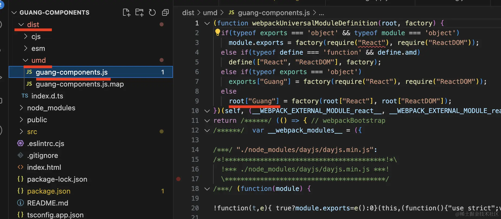

排除的三个模块也没有打包进去

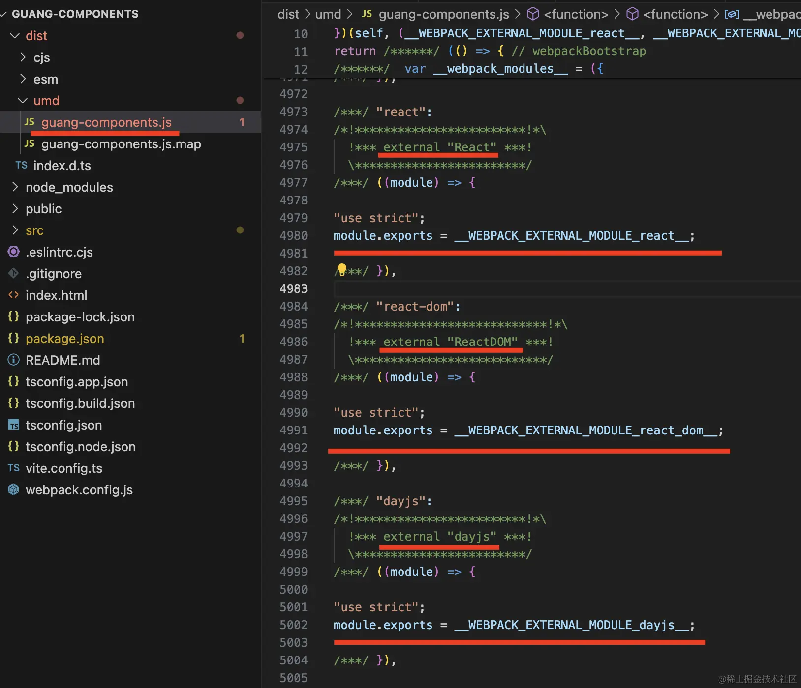

在package.json增加下unpkg的入口发布上线后就可以通过第三方js形式引入使用了

https://unpkg.com/包名

```json
"main": "dist/cjs/index.js",
"module": "dist/esm/index.js",
"types": "dist/esm/index.d.ts",
"unpkg": "dist/umd/guang-components.js",
"files": [
    "dist",
    "package.json",
    "README.md"
],
```