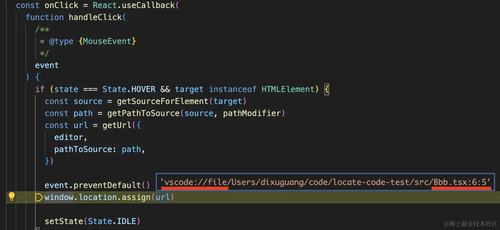

## 使用

```jsx
import React from 'react'
import ReactDOM from 'react-dom/client'
import App from './App.tsx'
// @ts-ignore
import { ClickToComponent } from 'click-to-react-component';

ReactDOM.createRoot(document.getElementById('root')!).render(
    <>
        <ClickToComponent />
        <App />
    </>
)
```

按住 option + 单击，就会直接打开它的对应的组件的源码


如果按住 option + 右键单击，可以看到它的所有父级组件，然后选择一个组件打开：


比如这种调试方式是不是很爽呢

## 原理

首先，怎么通过标签拿到对应组件的？

react 在标签上添加了 __reactFiber$ 开头的属性，可以拿到对应的 fiber 节点。

我们复制某个 dom 元素的选择器：


用 document.querySelector 取出来放到 el 变量。

然后你输入 el.__react 的时候会提示出一些属性：


__reactFiber$ 属性就是 dom 元素对应的 Fiber 节点。

__reactProps$ 属性就是这个组件的 props。


而且，拿到 fiber 节点后还可以通过 _debugOwner 拿到 fiber 节点的父节点。


一层层向上找，直到为 null，

就是这个的实现原理：


当然，fiber 节点还要根据 tag 来转为具体的类型。


比如 tag 为 10 是 Provider，tag 为 11 是 forwardRef 等。

这样，怎么从标签拿到对应的 fiber 节点我们就知道了。

那如何拿到组件在源码的文件和行列号呢？

这个通过 fiber 节点的 _debugSource 属性。


这个只有组件类型的 fiber 节点才有。

<b style="color:red">_debugSource属性只有开发环境才有</b>

这个 _debugSource 属性是怎么加上的呢？react 并不知道组件在哪个文件定义的啊。

是 babel 插件做的：


@babel/plugin-transform-react-jsx-source 这个插件内置在 @babel/preset-env 里，不用手动引入。

它会在编译 jsx 的时候添加 _source 属性，然后 react 源码里再把 _source 属性的值添加到 fiber._debugSource 上。


那如何打开 vscode 呢？

只要在浏览器打开 vscode://file/文件绝对路径:行号:列号 的地址，就可以自动在 vscode 打开对应文件，并把光标定位到目标行列号。



这样，整个流程我们都理清了，点击标签的时候怎么拿到对应的 fiber 节点，拿到所有父组件，拿到组件的行列号，然后打开 vscode。

此外，还有一些 ui 上的实现原理：


hover 的时候会框选对应组件。

它定义了 data-xxx 的样式。


然后通过 useState 创建了状态来保存当前 target。

mousemove 的时候修改 target。


当 target 改变，就会给它设置 dataset.xxx 属性。


这个 dataset 大家可能没用过：

如果你给一个 dom 元素设置 dataset.aaaBbbCccDdd = 1

那它就会有一个 data-aaa-bbb-ccc-ddd="1" 的属性。


然后我们前面定义的 [data-xx] 的样式就生效了，就加上了框选的样式。

至于这个 popover，是用 @floating-ui 做的，所有浮动元素都可以用这个来做。


click-to-react-component 需要在生产环境去掉么？

不需要

它内部做了处理：


这个组件放在任何位置都会生效，并不一定在main.js

因为它的事件都是绑定在 window上的：


