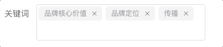
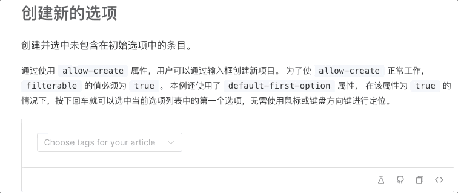
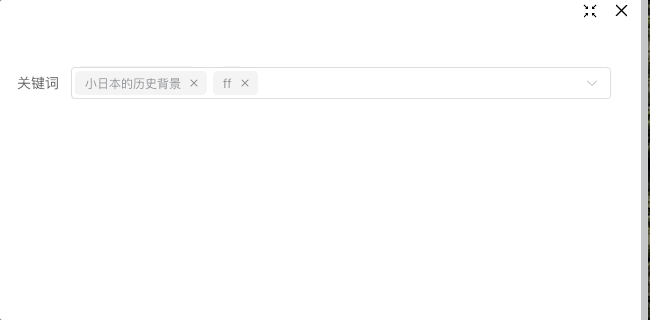
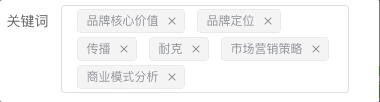
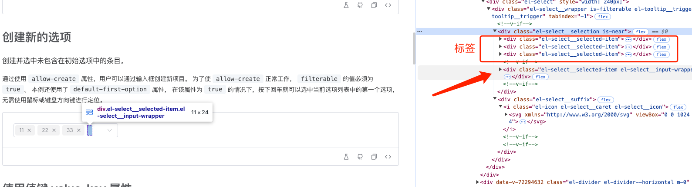
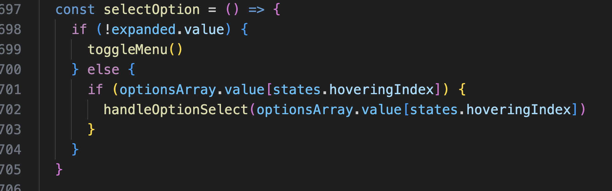
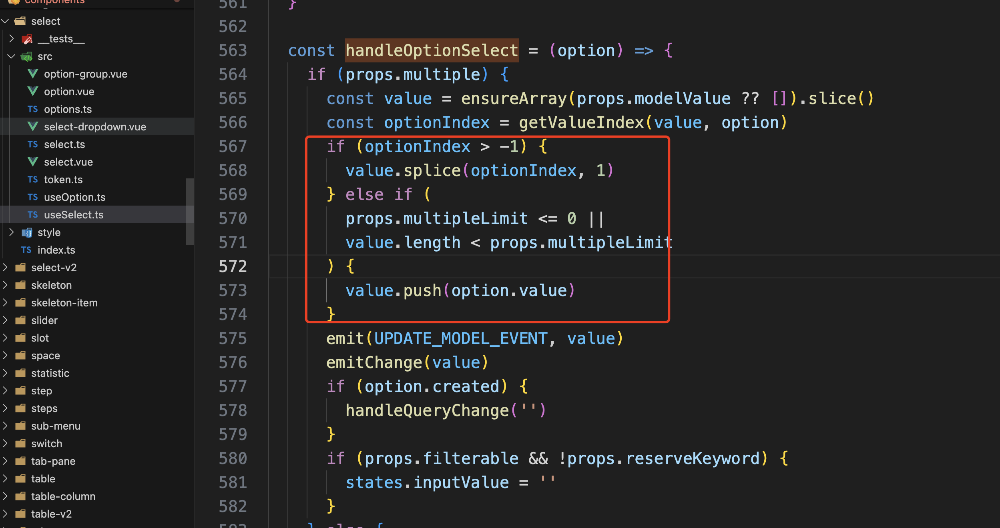

在一个风和日丽的天气，产品提了一个需求，想要在输入框回车把文字变成标签的需求，最后效果如图


第一反应去找element的input组件，找了 半天 没有 emmmm

然后在element 的 select组件看到了类似操作 如图



发现了几个问题

- 输入重复元素，会自动去重，删除原有的两个

- 下拉框会展示内容 


显然 这两点都不是我们想要的结果

关于 第二点 很好解决 

<b style="color: red">利用 css的 display: noe 直接隐藏掉，简单粗暴 完美解决</b>

第一点就有点难受了， 于是乎我们监听input和enter事件，手动记录了标签内容，在响应时机进行了重新赋值，效果如下



既能检测出来重复元素，又不至于丢失，也完美解决

但是总觉得这样不够优雅，数据一删除一赋值的操作造成这个控件的闪烁，对于精益求精的我来说这肯定是不能接受的，于是乎打算自己实现一个吧 

我的思路是创建一个div标签 利用div的contenteditable属性让其变成可编辑的，内部可以渲染标签元素，然后光标位置通过js的监听手动去调整，效果如下



观察上图的 <b style="color: red">光标</b> 因为落下的位置不对  js监听 input事件，手动调整光标位置，但是这样会有一个问题就是一闪一闪的 emmm.....  直接无解 （忽略最后定位不对的问题 这个很容易解决）

这个时候就比较难受了 想了半天也没想到好的处理方式，最后还是放弃了自己去做

```html
<template>
    <div class="cus_select" contenteditable="true" ref="editableDiv" @keydown.enter="handleEnter" @click="ensureCaretPosition">
        <el-tag class="tag" v-for="tag in modelValue" :key="tag" closable type="info" @close="handleClose(tag)">
            {{ tag }}
        </el-tag>
    </div>
</template>

<script setup>
import { ref, defineProps, defineEmits } from "vue";

const props = defineProps({
    modelValue: Array
});
const emit = defineEmits(["update:modelValue"]);
const editableDiv = ref(null);

// 处理标签关闭事件
function handleClose(tag) {
    const newValue = props.modelValue.filter((t) => t !== tag);
    emit("update:modelValue", newValue);
}

// 处理回车键创建新标签
function handleEnter(event) {
    event.preventDefault(); // 阻止默认行为，如换行等
    const text = editableDiv.value.textContent.trim();
    if (text) {
        const newValue = [...props.modelValue, text];
        emit("update:modelValue", newValue);
    }
}

// 确保在内容末尾有一个可编辑的空节点，并定位光标
function ensureCaretPosition() {
    const div = editableDiv.value;
    if (div) {
        const range = document.createRange();
        const sel = window.getSelection();
        range.selectNodeContents(div);
        range.collapse(false); // 折叠到最后
        sel.removeAllRanges();
        sel.addRange(range);
    }
}
</script>

<style scoped>
.cus_select {
    width: 100%;
    border-radius: var(--el-border-radius-base);
    box-shadow: 0 0 0 1px var(--el-border-color) inset;
    box-sizing: border-box;
    padding: 4px 12px;
    display: flex;
    flex-wrap: wrap;
    gap: 4px;
    align-items: center;
}

.tag {
    margin: 0 4px;
    cursor: pointer;
}
</style>
```

但是element的select又是怎么实现的呢，好奇。。。。 于是去看了看了官方实现



发现这个小子真鸡贼啊， 一个普通div 包裹了几个tag和一个input  input放在最后把宽调到最小，然后通过v-if决定是不是渲染和失焦与聚焦

自己按照这个实现呢，写的代码太多了，好累，秉承能不写就不写的态度

然后就开始魔改select组件，从官网down下源码 把 其中的select组件 手动copy 到我们项目，然后找到那一块删除的逻辑给魔改下就能得倒我们想要的效果了





果然还是官方组件香～～～