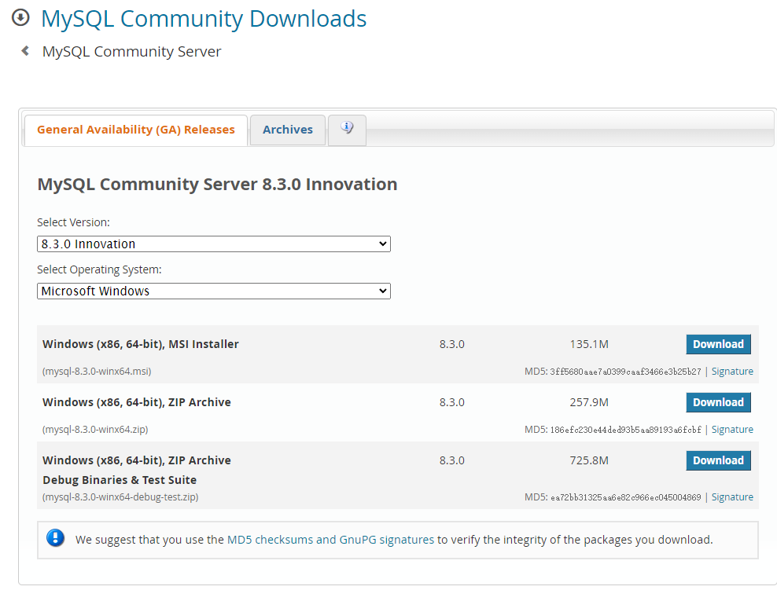
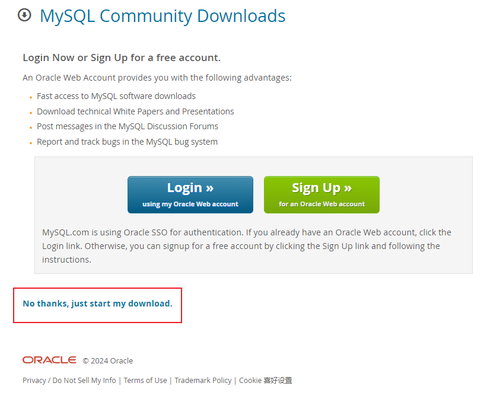
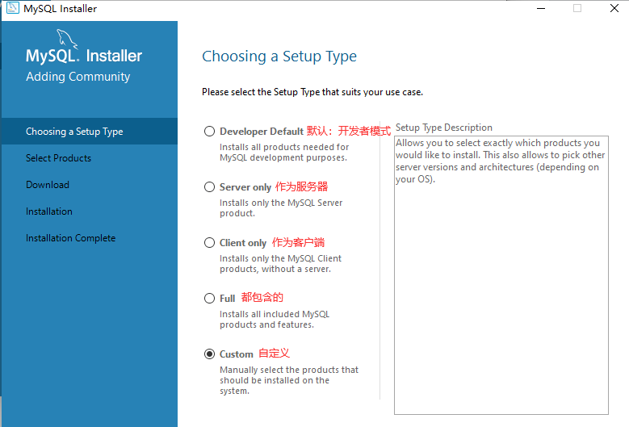
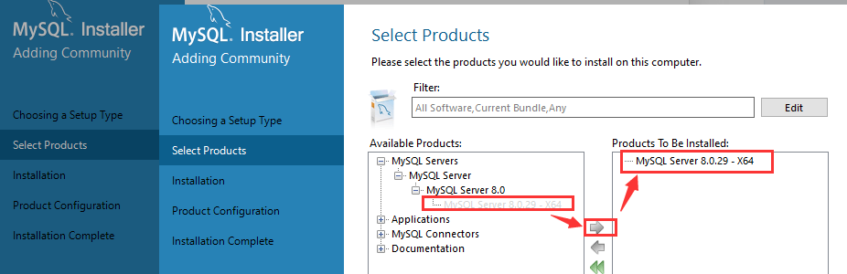
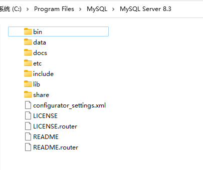
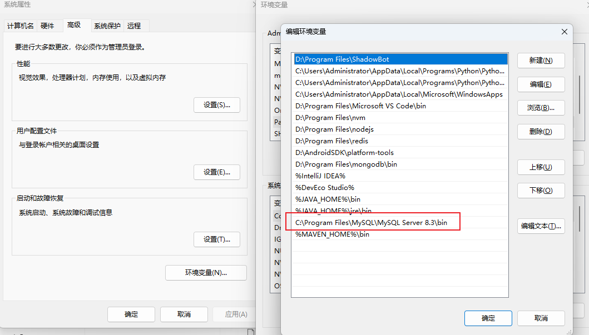
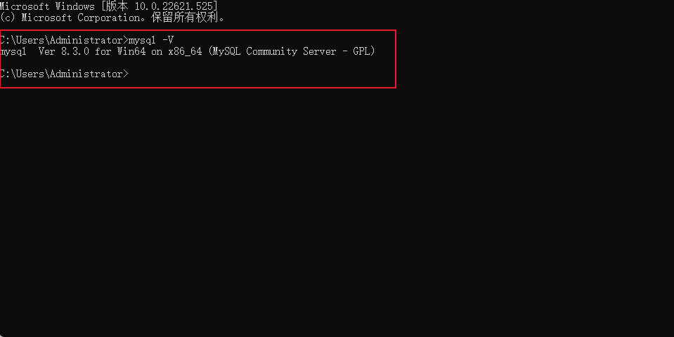
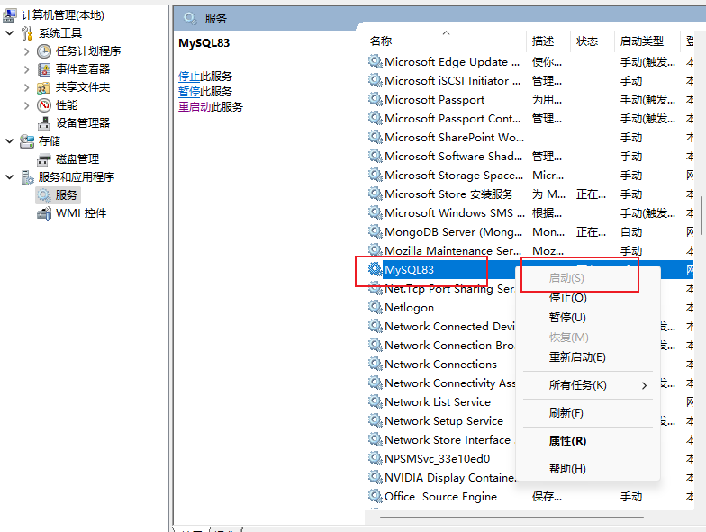

## 下载MySQL
MySQL 官网：www.mysql.com/cn/
MySQL 8.3.0 下载地址：dev.mysql.com/downloads/mysql/



可以看到，最新版本为 8.3.0。它提供了压缩版本，直接解压配置就可以使用，如果需要下载 msi 格式文件（可以通过图形化界面操作），可以选择第一个，这里使用 msi 格式文件下载。

点击第一个进行下载，这里面会提示是否要登陆，我们选择不登陆直接下载即可。



## 安装

点击下载之后的 xxx.msi 文件开始安装流程，



下面的模式选择哪个可以根据自己的需求，一般选择 Server only即可。然后按照提示一步一步安装。



安装路径如果没有更改，会直接安装在 C 盘。

## 添加环境变量

> 不添加不影响使用



直接复制上面的路径，添加到环境变量里面。



注意需要定义到 bin目录下面。配置好环境变量之后，打开命令函输入：mysql -V显示如下，说明已经正常安装成功了。



## 启动mysql

找到此电脑，右击选择”管理”；选择”服务”选项；然后找到 MYSQL 手动进行开启。



<b>
命令含开启 MYSQL 服务
</b>

以管理员身份打开命令行：


一般开启在 Windows 系统中，启动和停止 MySQL 服务可以使用类似 net start 和 net stop 的命令。下面是在 Windows 环境下启动和停止 MySQL 服务的示例命令：

启动 MySQL 服务：

```js
net start mysql
```

停止 MySQL 服务：

```js
net stop mysql
```

## 常用的几个命令

<b style="color: red">注意！！！每一条命令，都需要以分号结尾，要不然会遇到各种奇奇怪怪的问题。
</b>

连接到 MySQL：

```js
mysql -u username -p
```

显示数据库：

```js
SHOW DATABASES;
```

创建数据库：

```js
CREATE DATABASE database_name;
// database_name 是数据库名称
```

选择数据库：

```js
USE database_name;
```

显示数据表：

```js
SHOW TABLES;
```

显示数据表结构：

```js
DESCRIBE table_name;
```

查询数据：

```js
SELECT * FROM table_name;
```

插入数据：

```js
INSERT INTO table_name (column1, column2, ...) VALUES (value1, value2, ...);
```

更新数据：

```js
UPDATE table_name SET column1 = value1, column2 = value2 WHERE condition;
```

删除数据：

```js
DELETE FROM table_name WHERE condition;
```

删除表：

```js
DROP TABLE table_name;
```

删除数据库：

```js
DROP DATABASE database_name;
```

## 命令行导入sql文件

```sql
mysql -u your_username -p your_database_name < path\to\your\file.sql
```
请替换 your_username 为您的MySQL用户名，your_database_name 为您要导入的数据库名称，path\to\your\file.sql 为您的.sql文件的路径。

分步骤来

登录到MySQL服务器：

```js
mysql -u your_username -p
```

选择要使用的数据库：

```js
USE your_database_name;
```

导入.sql文件：

```js
source path\to\your\file.sql;
```

## windows 查看端口是否在使用

```js
netstat -aon|findstr "5001"
```

## windows 查看杀死端口

```js
taskkill /T /F /PID 9088
```
